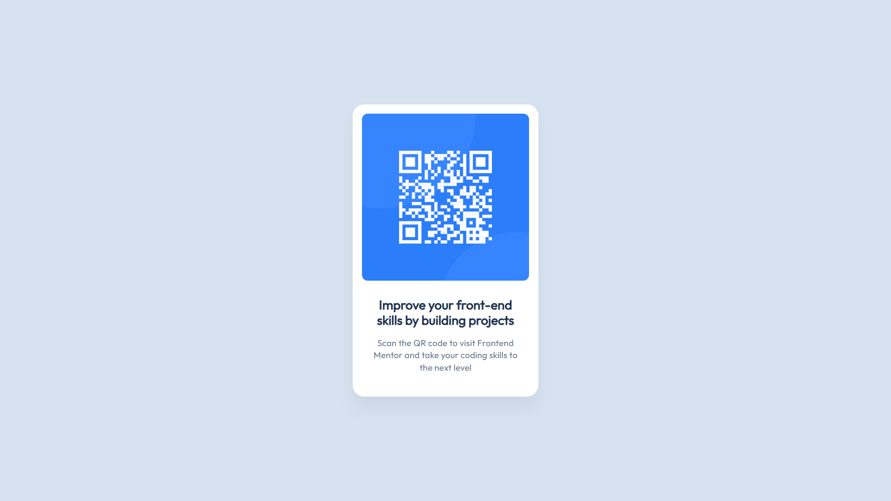

# Frontend Mentor - QR code component solution

This is a solution to the [QR code component challenge on Frontend Mentor](https://www.frontendmentor.io/challenges/qr-code-component-iux_sIO_H). Frontend Mentor challenges help you improve your coding skills by building realistic projects. 

## Table of contents

- [Overview](#overview)
  - [Screenshot](#screenshot)
  - [Links](#links)
- [My process](#my-process)
  - [Built with](#built-with)
  - [What I learned](#what-i-learned)
- [Author](#author)

## Overview

### Screenshot



### Links

- Solution URL: [solution](https://github.com/firewallls/frontend_Mentor_qr_solution/tree/main)
- Live Site URL: [See live site](https://firewallls.github.io/frontend_Mentor_qr_solution/)

## My process

### Built with

- Semantic HTML5 markup
- Flexbox
- [Styled Components](https://fonts.googleapis.com/css?family=Outfit) - For font style

### What I learned

While working on this my Major learning was to align it in center vertically

and to do that i use following code, see below:


```css
body {
  min-height: 100vh;
  display: flex;
  align-item: center
}
```

## Author

- Frontend Mentor - [@firewallls](https://www.frontendmentor.io/profile/firewallls)
